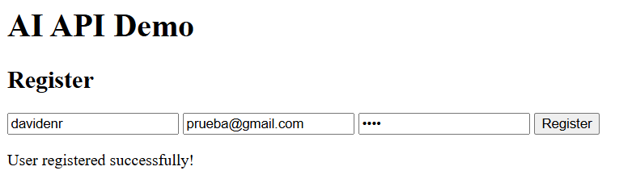
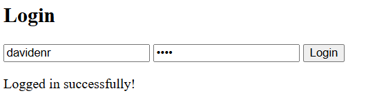
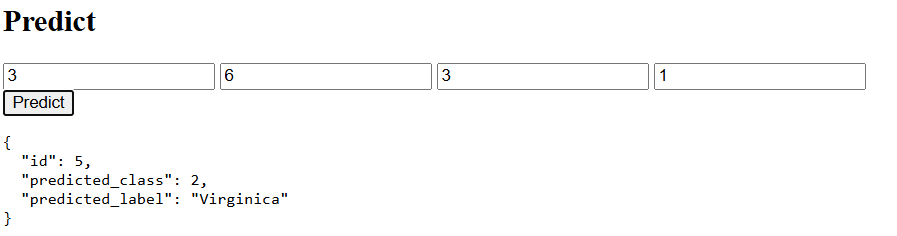
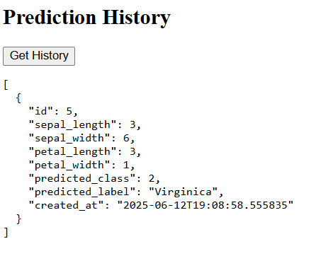
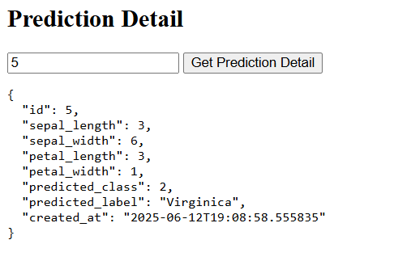

# AI API Demo

A FastAPI backend application featuring user authentication, Iris flower prediction using an ONNX model, prediction history tracking. Also includes a simple HTML + JavaScript frontend to interact with the API.

## Features

- User registration and login (JWT token authentication)
- Iris flower species prediction endpoint
- User-specific prediction history retrieval
- Detailed prediction information by ID
- Prediction statistics (counts by predicted class)
- Simple interactive frontend for easy testing

## Requirements

- Python 3.8 or higher
- SQLite (default) or any other SQL database compatible with SQLAlchemy
- Dependencies listed in `requirements.txt` (FastAPI, SQLAlchemy, ONNX Runtime, etc.)

## Table of Contents

- [Setup](#setup)
- [API Usage](#api-usage)
- [Frontend Usage](#frontend-usage)


##  Setup

### 1. Clone the repository

```bash
git clone https://github.com/David-Enriquez77/ai_api_project_test.git
cd ai_api_project_test
```

### 2. Create and activate a virtual environment

```bash
# Create virtual environment
python -m venv venv

# Activate it on Linux/macOS
source venv/bin/activate

# Or activate it on Windows
venv\Scripts\activate
```

### 3. Install the dependencies

```bash
pip install -r requirements.txt
```

### 4. (NOTE) Use environmental variables that are within the project

Since its only for practice, you can use the .env file without the need to create one from zero. For a quicker setup

### 5. Initialize the database

Open a Python shell and run the following:

```python
from app.db.database import Base, engine
Base.metadata.create_all(bind=engine)
```

### 6. Run the FastAPI backend

```bash
uvicorn app.main:app --reload
```

Access the API at: [http://127.0.0.1:8000](http://127.0.0.1:8000)

#  API Usage

### Endpoints:

- `POST /auth/register`: Register a new user
- `POST /auth/login`: Login and receive a JWT token
- `POST /predict/`: Make a prediction
- `GET /predictions/`: Get all your past predictions
- `GET /predictions/{id}`: Get details of a specific prediction
- `GET /predictions/stats`: Get summary of predictions grouped by class

### Authenticated Requests:

For endpoints that require authentication, include your JWT token:

```http
Authorization: Bearer YOUR_TOKEN
```

---

#  Frontend Usage

Open `http://127.0.0.1:8000/` in your browser and follow these steps:
1. **Register** a new account using a username, email, and password
   
   
2. **Login** to receive your JWT token
   
 
3. Enter feature values and click **Predict**
   
  
4. Click **Get History** to load previous predictions
    

5. Enter an ID and click **Get Prediction Detail** to view details of a single prediction
    

##  API Docs

For more documentation you can access docs, once the server is running locally

 [http://127.0.0.1:8000/docs](http://127.0.0.1:8000/docs)


